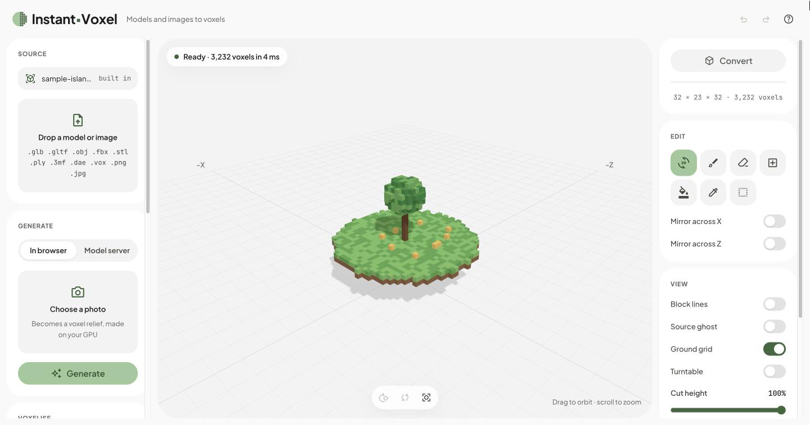

<h1>
  <picture>
    <source media="(prefers-color-scheme: dark)" srcset="web/assets/logo-inverse.svg">
    
  </picture>
</h1>

**Live: [instantvoxel.thitichotk.com](https://instantvoxel.thitichotk.com)** (desktop first, runs in your browser)

Instant-Voxel turns 3D models and images into voxel art in the browser. A C++ kernel compiled to WebAssembly does the
voxelising and three.js reads the model files and draws the result. You can touch the voxels up one by one before
exporting them for MagicaVoxel, Minecraft, a game engine or a 3D printer. Your files stay on your computer; only the
optional model server receives anything, and you choose where it runs.



## Using it

1. Drop a model, an image or a `.vox` file onto the page, or pick files under **Source**. For a model in several
   files, drop them together (`.gltf` with its `.bin` and textures, `.obj` with its `.mtl`).
2. Set the **Size** and the other **Voxelise** options. Models re-voxelise as you change them; the buttons under the
   viewport turn a model 90° at a time.
3. Touch it up with the **Edit** tools. With a tool selected, left-drag edits and right-drag orbits. Press **?** for
   the keyboard shortcuts.
4. Choose a format under **Export** and press **Download**.

The page opens on a small sample island, so the editor and the exports can be tried straight away.

## What it does

- **Models in:** GLB, glTF, OBJ with MTL, FBX, STL, PLY, 3MF and DAE, with textures, vertex colours, skinning and
  morphs. Each voxel takes its colour from the nearest surface.
- **Images in:** pixel art extruded voxel for voxel, or a greyscale heightmap as terrain.
- **AI, in the browser:** a photo becomes a voxel relief using Depth Anything V2 on your GPU. The background is cut by
  depth, or by an AI mask where WebGPU is available. The models download once and are then cached.
- **AI, on a model server:** a photo or a text prompt becomes a full 3D object with Stable Fast 3D, running on your
  own machine or a hosted GPU ([`server/`](server/README.md)).
- **Voxelising:** up to 512 voxels per side, solid fill, hollow shells, removal of small floating islands, and a
  ghost of the source model to check the fit.
- **Colour:** an automatic palette (median cut in Oklab, 2 to 255 colours), Minecraft blocks, a default cube, or any
  `.hex` palette, with optional dithering.
- **Editing:** paint, erase, add, fill a region, pick a colour and box tools, with brush sizes, mirroring across X and
  Z, undo and redo, and a cut-height slider to work inside the model.

| Export | For | Notes |
|---|---|---|
| `.vox` | MagicaVoxel | Grids over 256 on a side become a scene of several models |
| `.glb` | Game engines | One mesh per 32³ chunk, the palette as a 256 × 1 texture, sized in metres |
| `.obj` | Blender | Vertex colours, sized in metres |
| `.stl` | 3D printing | Millimetres and Z up, one quad per face so there are no T-junctions |
| `.schem` | Minecraft (WorldEdit, FAWE, Litematica) | Sponge Schematic v2; each colour becomes the nearest of 93 full blocks |

The voxel size in millimetres applies to `.glb`, `.obj` and `.stl`.

## Run it locally

Needs Python 3 (or any static file server) and Node 22 for the tests. Rebuilding the kernel also needs
[Emscripten](https://emscripten.org/).

```bash
git clone https://github.com/thitichotk/instant-voxel.git
cd instant-voxel
python3 -m http.server -b 127.0.0.1 -d web 3000   # http://127.0.0.1:3000
node tests/run.mjs                                # the kernel and the pure modules
./build.sh                                        # rebuild web/voxelizer.js and .wasm from src/voxelizer.cpp
```

Python's server lets the browser cache files, so while editing keep DevTools open with **Disable cache** ticked. The
optional model server has its own setup in [`server/README.md`](server/README.md).

Cloudflare Pages deploys `web/` from `main` as it is (there is no build step), and each pull request gets a preview
link. The compiled kernel is committed, so rebuild and commit it whenever `src/voxelizer.cpp` changes.

## How it works

1. **Reading.** three.js loaders read the model files, and `loaders.js` flattens the scene into one triangle mesh
   with positions, UVs, vertex colours and materials, in world space.
2. **Voxelising.** A Web Worker runs the C++ kernel. Every triangle that overlaps a voxel competes for it, and the one
   closest to the voxel's centre colours it, sampling texture × vertex colour × material colour in linear light.
   Median cut in Oklab then picks the palette, or each colour maps to the nearest entry of a fixed one. Solid fill
   floods the air from outside and fills whatever it can't reach.
3. **Showing and editing.** The grid is one byte per voxel with a 256-colour palette. It is meshed in 32³ chunks with
   greedy quads, and an edit remeshes only the chunks it touches.
4. **Exporting.** Each format is written straight from the grid in the browser.

| Path | Role |
|---|---|
| `web/index.html`, `web/styles.css` | The page and its layout |
| `web/tokens.css`, `web/components.css` | The Instant-Voxel design system: moss on white, pill controls, Plus Jakarta Sans |
| `web/main.js` | Sources, settings, editing and export |
| `web/preview.js` | The three.js viewport: chunk meshes, picking, the ghost, the turntable |
| `web/loaders.js` | Model files to three.js, then to the kernel's triangle mesh |
| `web/worker.js` | Runs the kernel, image conversion, the AI depth model and meshing off the main thread |
| `src/voxelizer.cpp` | The voxel kernel; `build.sh` compiles it to `web/voxelizer.js` and `web/voxelizer.wasm` |
| `web/mesher.js`, `web/editor.js`, `web/image.js` | Greedy meshing; brush, box, fill and undo; images to voxels |
| `web/vox.js`, `web/schem.js`, `web/export.js` | `.vox` in and out; `.schem`; `.glb`, `.obj` and `.stl` |
| `web/palettes.js`, `web/mc-blocks.js` | Palettes, `.hex` files, and the Minecraft block colours |
| `web/ai.js` | The in-browser depth and mask models, and the model-server client |
| `web/sample.vox` | The sample island the page opens on |
| `server/` | The optional model server (FastAPI) |
| `tests/run.mjs` | Self-checks for the kernel and the pure modules |

Built with plain HTML, CSS and ES modules, [three.js](https://threejs.org/) 0.169,
[Emscripten](https://emscripten.org/) (C++17 to WebAssembly) and
[transformers.js](https://huggingface.co/docs/transformers.js) 4.3. There are no npm dependencies.

## Limits

- 512 voxels per side at most. A grid that size needs about 0.5 GB of memory while it is built.
- `.vox` files open with their models placed but not rotated; scene rotations are ignored.
- The AI background mask needs WebGPU and downloads about 115 MB once. The depth model is 27 to 50 MB.
- The model server needs a GPU or about 32 GB of unified memory on a Mac.
- The editor is designed for a desktop. On a phone, viewing, converting and exporting work, but editing is awkward.
- When one mesh uses textures with different transforms, every texture takes the first transform.

## Credits and licence

- [three.js](https://github.com/mrdoob/three.js) (MIT) and
  [transformers.js](https://github.com/huggingface/transformers.js) (Apache-2.0) load from jsDelivr.
- [Depth Anything V2 Small](https://huggingface.co/onnx-community/depth-anything-v2-small) (Apache-2.0) and
  [BiRefNet lite](https://huggingface.co/onnx-community/BiRefNet_lite-ONNX) (MIT) load from Hugging Face on first
  use.
- The model server downloads Stable Fast 3D (Stability AI Community License, "Powered by Stability AI") and SDXL
  with SDXL-Lightning (CreativeML Open RAIL++-M); see [`server/README.md`](server/README.md).
- Plus Jakarta Sans and JetBrains Mono (SIL Open Font License) and Material Symbols (Apache-2.0) come from Google
  Fonts.
- The block colours are averages of Minecraft's textures; no textures are included.

[MIT](LICENSE) © 2026 Thitichot K.

Not affiliated with Mojang, Microsoft, MagicaVoxel or Stability AI.
